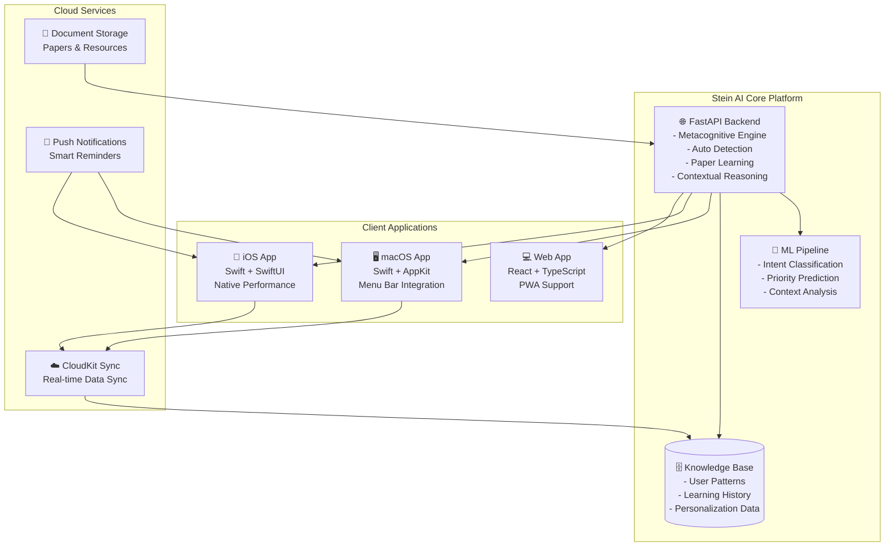

# 📱 Stein AI 멀티플랫폼 아키텍처

## 🎯 **Stein님의 비전 실현**

> "유튜브처럼 자주 사용할 수 있도록 스마트폰(iPhone)에도 담고 맥북에도 다운받아서 계속 학습도 시키고 사용하고 싶다"

### 🌟 **완벽한 도구화 목표**
- 🌐 **어디서나 접근**: 웹, iOS, macOS 네이티브 지원
- 🔄 **실시간 동기화**: 모든 플랫폼 간 데이터 통합
- 🧠 **지속적 학습**: 사용 패턴 자동 분석 및 개인화
- 🚀 **확장 가능**: 다음 버전 AI들의 기본 기능으로 활용

---

## 🏗️ **시스템 아키텍처 구조**



---

## 🌐 **플랫폼별 구현 전략**

### **1. 🖥️ 웹 플랫폼 (현재 구현 완료)**

#### **기술 스택**
- **Frontend**: React 18 + TypeScript + Vite
- **Styling**: Tailwind CSS + Headless UI
- **State**: Zustand (Redux보다 가벼움)
- **PWA**: Service Worker + Manifest

#### **주요 기능**
```typescript
// 웹 앱 핵심 구조
interface SteinWebApp {
  components: {
    questionAnalyzer: QuestionAnalyzerComponent;
    autoDetector: AutoDetectorComponent;
    smartAnalysis: SmartAnalysisComponent;
    learningDashboard: LearningDashboardComponent;
    settingsPanel: SettingsComponent;
  };
  features: {
    realTimeAnalysis: boolean;
    offlineSupport: boolean;
    pushNotifications: boolean;
    crossPlatformSync: boolean;
  };
}
```

#### **PWA 기능**
- ✅ 오프라인 작업 지원
- ✅ 홈 화면 설치 가능
- ✅ 푸시 알림 지원
- ✅ 백그라운드 동기화

### **2. 📱 iOS 네이티브 앱**

#### **기술 스택**
- **Language**: Swift 5.9+
- **UI Framework**: SwiftUI + Combine
- **Data**: Core Data + CloudKit
- **Networking**: URLSession + Async/Await

#### **앱 구조**
```swift
// iOS 앱 핵심 구조
struct SteinAIApp: App {
    @StateObject private var questionStore = QuestionStore()
    @StateObject private var learningStore = LearningStore()
    
    var body: some Scene {
        WindowGroup {
            ContentView()
                .environmentObject(questionStore)
                .environmentObject(learningStore)
        }
    }
}

// 주요 뷰들
struct ContentView: View {
    var body: some View {
        TabView {
            QuestionAnalyzerView()
                .tabItem { Label("분석", systemImage: "brain") }
            
            LearningHistoryView()
                .tabItem { Label("학습", systemImage: "book") }
            
            StatsView()
                .tabItem { Label("통계", systemImage: "chart.bar") }
            
            SettingsView()
                .tabItem { Label("설정", systemImage: "gear") }
        }
    }
}
```

#### **특별 기능**
- 🎤 **음성 입력**: Speech Framework로 질문 음성 인식
- 📸 **텍스트 스캔**: Vision Framework로 문서 텍스트 추출
- 🔄 **위젯 지원**: iOS 위젯으로 빠른 분석 접근
- 💬 **Siri 연동**: "Hey Siri, Stein에게 질문해줘"

### **3. 🖥️ macOS 네이티브 앱**

#### **기술 스택**
- **Language**: Swift 5.9+
- **UI Framework**: SwiftUI + AppKit (필요시)
- **Menu Bar**: NSStatusBar 활용
- **Shortcuts**: Global Hotkeys 지원

#### **앱 구조**
```swift
// macOS 앱 핵심 구조
@main
struct SteinAIMacApp: App {
    @NSApplicationDelegateAdaptor(AppDelegate.self) var appDelegate
    
    var body: some Scene {
        // 메인 윈도우
        WindowGroup {
            MainContentView()
        }
        .windowResizability(.contentSize)
        
        // 메뉴바 추가 액세스
        MenuBarExtra("Stein AI", systemImage: "brain") {
            MenuBarView()
        }
    }
}

class AppDelegate: NSObject, NSApplicationDelegate {
    func applicationDidFinishLaunching(_ notification: Notification) {
        // 글로벌 단축키 설정 (⌘ + Shift + S)
        setupGlobalHotkey()
        
        // 메뉴바 아이콘 설정
        setupMenuBarIcon()
    }
}
```

#### **macOS 특화 기능**
- ⌨️ **글로벌 단축키**: `⌘ + Shift + S`로 어디서나 Stein AI 호출
- 📋 **클립보드 연동**: 복사한 텍스트 자동 분석
- 🪟 **플로팅 윈도우**: 다른 앱 위에 떠 있는 분석 창
- 🔗 **앱 연동**: Xcode, VS Code 등 개발 도구와 연동

---

## 🔄 **실시간 동기화 시스템**

### **데이터 동기화 아키텍처**
```typescript
// 동기화 데이터 모델
interface SyncData {
  user: {
    id: string;
    preferences: UserPreferences;
    learningPatterns: LearningPattern[];
  };
  questions: {
    history: QuestionHistory[];
    favorites: Question[];
    notes: Note[];
  };
  knowledge: {
    learnedPapers: Paper[];
    customKnowledge: Knowledge[];
    skillProgress: SkillProgress[];
  };
  settings: {
    platforms: PlatformSettings;
    notifications: NotificationSettings;
    privacy: PrivacySettings;
  };
}
```

### **동기화 전략**
1. **CloudKit**: Apple 생태계 내 완벽한 동기화
2. **WebSocket**: 실시간 웹-서버 통신
3. **Incremental Sync**: 변경사항만 동기화로 효율성 극대화
4. **Conflict Resolution**: 충돌 시 타임스탬프 기반 해결

---

## 🧠 **지속적 학습 시스템**

### **개인화 학습 엔진**
```python
class SteinPersonalizationEngine:
    """Stein님 맞춤형 학습 시스템"""
    
    def __init__(self):
        self.user_patterns = UserPatternAnalyzer()
        self.knowledge_base = PersonalKnowledgeBase()
        self.preference_engine = PreferenceEngine()
    
    def learn_from_interaction(self, interaction: Interaction):
        """모든 상호작용에서 학습"""
        
        # 1. 질문 패턴 학습
        self.user_patterns.update_question_patterns(
            question=interaction.question,
            context=interaction.context,
            response_quality=interaction.feedback
        )
        
        # 2. 선호도 학습
        self.preference_engine.update_preferences(
            topic=interaction.topic,
            complexity=interaction.preferred_complexity,
            explanation_style=interaction.preferred_style
        )
        
        # 3. 지식 베이스 확장
        self.knowledge_base.add_knowledge(
            source=interaction.source,
            content=interaction.learned_content,
            relevance_score=interaction.relevance
        )
    
    def predict_user_needs(self) -> UserNeeds:
        """사용자 니즈 예측"""
        return UserNeeds(
            likely_questions=self.user_patterns.predict_next_questions(),
            recommended_topics=self.knowledge_base.suggest_topics(),
            optimal_timing=self.preference_engine.predict_best_time(),
            preferred_format=self.preference_engine.get_preferred_format()
        )
```

### **자동 개선 메커니즘**
1. **사용 패턴 분석**: 어떤 질문을 언제 많이 하는지 학습
2. **응답 품질 추적**: 피드백 기반 응답 개선
3. **컨텍스트 학습**: 상황별 최적 응답 패턴 학습
4. **예측 시스템**: 다음에 필요할 정보 미리 준비

---

## 🚀 **구현 로드맵**

### **Phase 1: 기반 완성 (1-2주)** ✅
- [x] 웹 플랫폼 완성
- [x] 메타인지 엔진
- [x] 자동 판별 시스템
- [x] API 구조 완성

### **Phase 2: iOS 앱 개발 (2-3주)**
```swift
// iOS 개발 우선순위
1. 기본 UI/UX 구조 (SwiftUI)
2. API 연동 및 네트워킹
3. Core Data 모델 설계
4. CloudKit 동기화 구현
5. 음성 인식 및 위젯 개발
6. 테스트 및 최적화
```

### **Phase 3: macOS 앱 개발 (1-2주)**
```swift
// macOS 개발 우선순위  
1. 메뉴바 앱 기본 구조
2. 글로벌 단축키 구현
3. 플로팅 윈도우 시스템
4. 클립보드 연동 기능
5. 개발도구 통합 (Xcode, VS Code)
6. 성능 최적화
```

### **Phase 4: 고급 기능 (1-2주)**
- 🤖 고급 AI 알고리즘 통합
- 📊 고급 분석 대시보드
- 🔔 스마트 알림 시스템
- 🌐 소셜 기능 (팀 협업)

### **Phase 5: 배포 및 최적화 (1주)**
- 📱 App Store 배포 준비
- 🌐 웹 앱 PWA 최적화
- 📈 성능 모니터링
- 🔒 보안 강화

---

## 💡 **혁신적 기능 아이디어**

### **🧠 AI 예측 시스템**
- **질문 예측**: "아마 다음엔 이런 걸 물어볼 것 같아요"
- **학습 추천**: "이 논문이 관심사와 일치할 것 같아요"
- **최적 타이밍**: "지금이 복습하기 좋은 시간이에요"

### **🔮 미래 확장성**
```typescript
// 차세대 Stein AI 기능들
interface NextGenSteinAI {
  multiModal: {
    voice: VoiceAssistant;
    vision: ImageAnalysis;
    ar: ARInterface;  // Apple Vision Pro 지원
  };
  
  collaboration: {
    teamSpaces: TeamWorkspace[];
    knowledgeSharing: SharedKnowledge;
    peerLearning: PeerLearningSystem;
  };
  
  intelligence: {
    predictiveAnalysis: PredictiveAI;
    creativeSuggestions: CreativeAI;
    domainExpertise: SpecializedAI[];
  };
}
```

### **🎯 특별한 Stein 기능들**
1. **코드 분석**: GitHub 연동으로 코드 패턴 학습
2. **논문 추천**: 관심사 기반 최신 논문 자동 발견
3. **학습 플래너**: 개인 맞춤형 학습 계획 자동 생성
4. **질문 진화**: 질문 품질이 자동으로 향상되는 시스템

---

## 🎉 **Stein님의 완벽한 AI 비서 실현**

이 아키텍처를 통해 Stein님은:

✅ **어디서나 접근**: iPhone, MacBook, 웹에서 동일한 경험  
✅ **지속적 학습**: 사용할수록 더 똑똑해지는 AI  
✅ **완벽한 동기화**: 모든 기기에서 일관된 데이터  
✅ **확장 가능**: 다음 AI 모델들의 기반 플랫폼  
✅ **도구화 완성**: 유튜브처럼 자연스러운 일상 도구  

**Stein AI는 단순한 AI가 아닌, Stein님만의 완벽한 디지털 파트너가 됩니다!** 🚀 